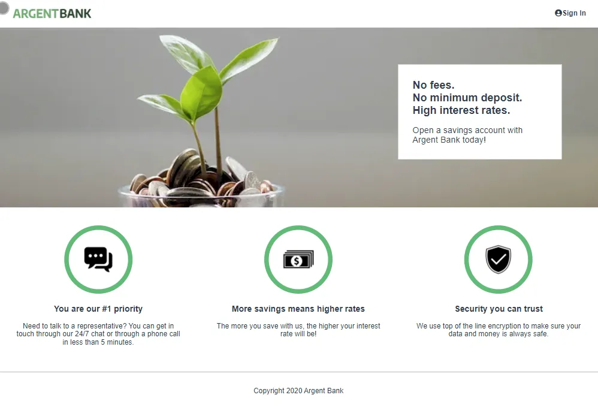
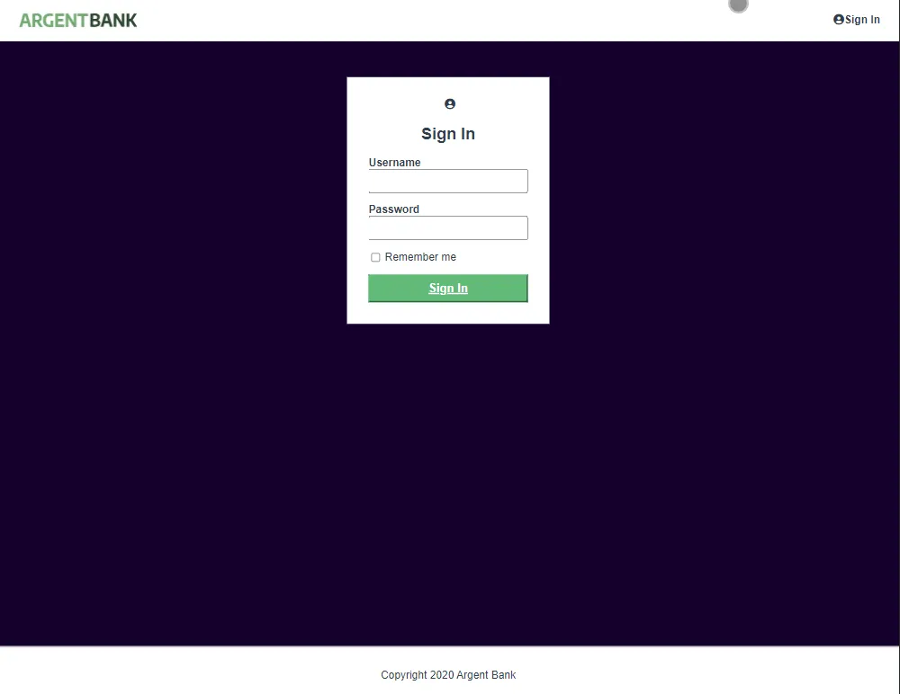
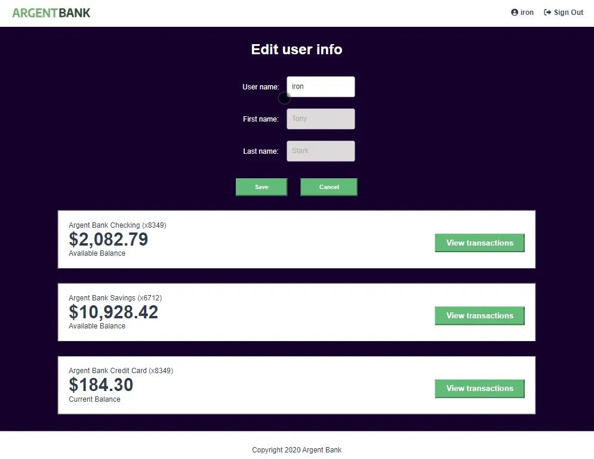
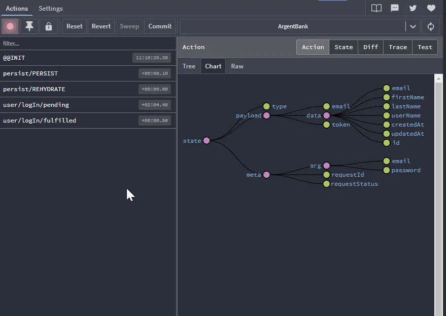

# Argent Bank

Projet 11 de la formation intégrateur web d'openClassrooms.
Apprentissage du state manager Redux pour gérer l'état d'une application.
## Installation back end

node.js doit être installé sur votre système.

```bash
npm install
```

## Usage

Voir le readme dans le backend

## Installation front end

```bash
npm install
```
## Usage
```bash
npm start
```
## Images du projet.





linux